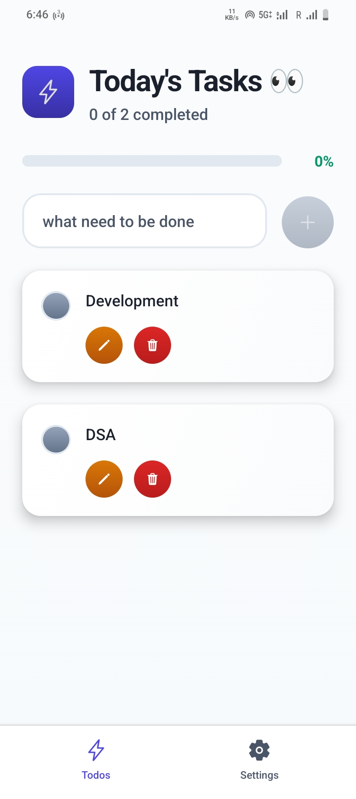

<div align="center">
  <h1 align="center">📱 Todo App</h1>
  <p align="center">
    A modern, cross-platform Todo application with real-time sync and beautiful UI
    <br />
    <a href="#-features">View Demo</a>
    ·
    <a href="https://github.com/yourusername/todo-app/issues">Report Bug</a>
    ·
    <a href="https://github.com/yourusername/todo-app/issues">Request Feature</a>
  </p>

  <p align="center">
    
    
    
    
  </p>

  <p align="center">
    
     
  </p>
</div>

## ✨ Features

<div style="display: grid; grid-template-columns: repeat(auto-fit, minmax(300px, 1fr)); gap: 1rem; margin: 1rem 0;">
  <div>
    <h4>📝 Task Management</h4>
    <ul>
      <li>Create, edit, and delete todos</li>
      <li>Mark tasks as complete/incomplete</li>
      <li>Real-time synchronization</li>
      <li>Offline-first capabilities</li>
    </ul>
  </div>
  <div>
    <h4>🎨 Beautiful UI/UX</h4>
    <ul>
      <li>Dark/Light theme support</li>
      <li>Smooth animations</li>
      <li>Pull-to-refresh</li>
      <li>Progress tracking</li>
    </ul>
  </div>
  <div>
    <h4>🌍 Cross-Platform</h4>
    <ul>
      <li>iOS support</li>
      <li>Android support</li>
      <li>Web support</li>
      <li>Responsive design</li>
    </ul>
  </div>
</div>

## 🚀 Tech Stack

### Frontend

| Technology | Description |
|------------|-------------|
|  | Mobile app framework |
|  | Type-safe JavaScript |
|  | Development platform |
|  | Navigation library |

### Backend

| Technology | Description |
|------------|-------------|
|  | Backend as a Service |
|  | RESTful API |

### Tools & Libraries

| Category | Technologies |
|----------|--------------|
| **UI Components** | React Native Paper, @expo/vector-icons |
| **State Management** | Convex, React Context |
| **Storage** | @react-native-async-storage/async-storage |
| **Styling** | React Native StyleSheet, Expo Linear Gradient |
| **Linting** | ESLint, Prettier |
| **Build Tools** | Expo CLI, TypeScript |

### Development

| Technology | Description |
|------------|-------------|
|  | JavaScript Runtime |
|  | Package Manager |
|  | Version Control |

## 🚀 Getting Started

### Prerequisites

- Node.js (v18 or later)
- npm or yarn
- Expo CLI (`npm install -g expo-cli`)
- Expo Go app (for mobile testing)
- Convex account (for backend services)

### Installation

1. **Clone the repository**
   ```bash
   git clone <repository-url>
   cd TodoApp
   ```

2. **Install dependencies**
   ```bash
   npm install
   # or
   yarn
   ```

3. **Set up Convex**
   ```bash
   npx convex init
   npx convex dev
   ```

4. **Start the development server**
   ```bash
   npx expo start
   ```

5. **Run on your device/emulator**
   - Press `i` for iOS simulator
   - Press `a` for Android emulator
   - Scan the QR code with Expo Go app (iOS/Android)
   - Press `w` to open in web browser

## 📱 Available Scripts

- `npm start` - Start the development server
- `npm run android` - Run on Android device/emulator
- `npm run ios` - Run on iOS simulator
- `npm run web` - Run on web browser
- `npm run lint` - Run ESLint
- `npm run reset-project` - Reset the project (use with caution)

## 🏗 Project Structure

```
TodoApp/
├── app/                    # Main application code
│   ├── (tabs)/             # Tab-based navigation
│   │   ├── index.tsx       # Main todos screen
│   │   └── Settings.tsx    # App settings
│   ├── _layout.tsx         # Root layout
│   └── (tabs)/_layout.tsx  # Tab layout
├── assets/                 # Static assets
│   ├── fonts/              # Custom fonts
│   ├── images/             # App images
│   └── styles/             # Global styles
├── components/             # Reusable components
│   ├── Todoinput.tsx       # Todo input component
│   ├── Header.tsx          # App header
│   └── ...
├── convex/                 # Backend functions and types
│   ├── todos.ts            # Todo-related database operations
│   └── schema.ts           # Database schema
└── hooks/                  # Custom React hooks
    └── useTheme.tsx        # Theme management
```

## 📝 License

This project is licensed under the MIT License - see the [LICENSE](LICENSE) file for details.

## 🤝 Contributing

Contributions are welcome! Please feel free to submit a Pull Request.

## 📬 Contact

Have questions or feedback? Feel free to open an issue or reach out to the maintainers.

---

Built with ❤️ using [Expo](https://expo.dev) and [Convex](https://convex.dev)
